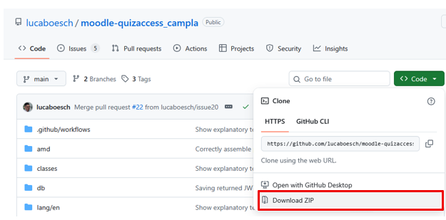
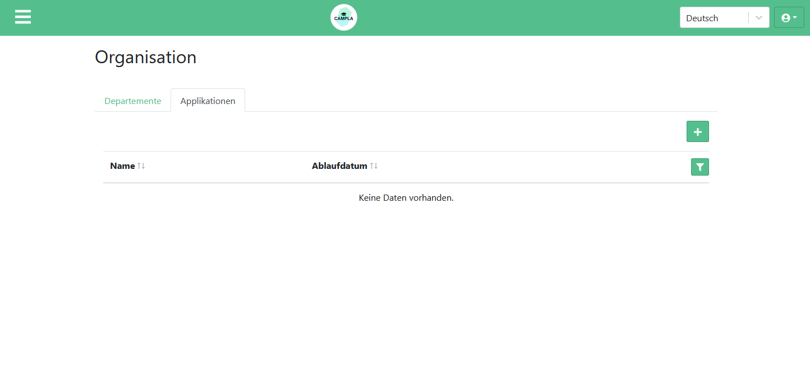
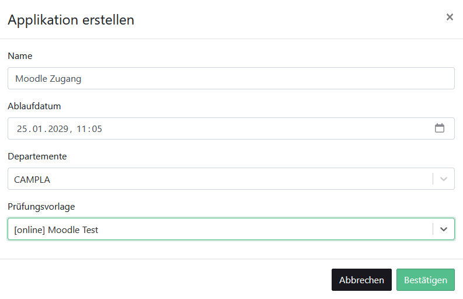
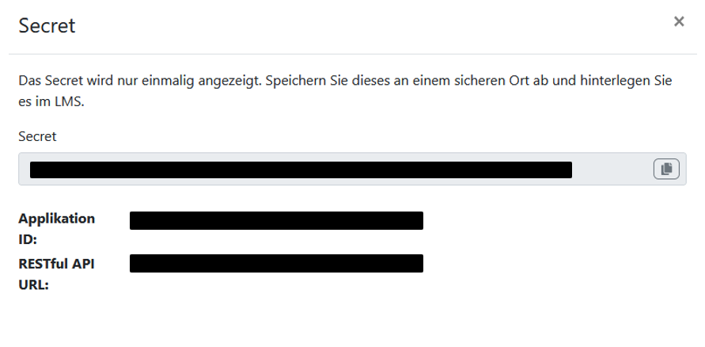
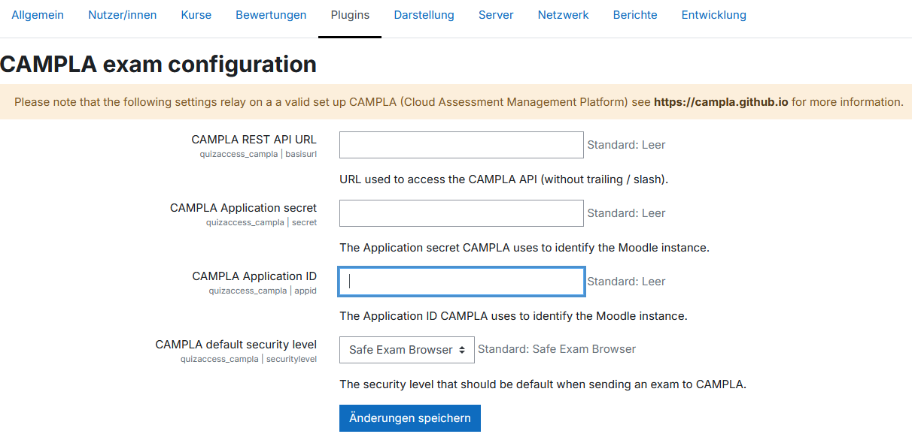

> **Important**
> These instructions are specifically intended for the following roles: **Administrators**

# CAMPLA Moodle Plugin

The Moodle Learning Management System (LMS) can be used in conjunction with CAMPLA for exams.  
To simplify exam administration, the Bern University of Applied Sciences (BFH) has developed a plugin for CAMPLA.  
This plugin allows CAMPLA exams associated with Moodle quizzes to be created automatically.  
This simplifies the creation of CAMPLA exams in conjunction with Moodle.

## Install plugin

The following guide describes how to install and configure the CAMPLA Moodle plugin.

> **Description**
> - Download [CAMPLA Moodle Plugin](https://github.com/lucaboesch/moodle-quizaccess_campla)
> - The [installation via ZIP file](https://docs.moodle.org/501/en/Installing_plugins#Installing_via_uploaded_ZIP_file) is described in the linked article

## Configure the plugin

In order for Moodle to create exams via the CAMPLA interface, access must be granted to Moodle.

> **Description**
> - Under the **Organization** menu item in the **Applications** tab, you can add applications
> - Click the **+** icon to open the entry dialog

> **Description**
> - **Name**: Name of the application
> - **Expiration date**: Date by which access must be renewed. Access must be renewed after three years at the latest
> - **Department**: Moodle automatically creates new modules. These are assigned to the configured **Department**
> - **Instance template**: **Instance template** to be used for creating exams

> **Description**
> - **IMPORTANT**: The **Secret** is displayed only once! Save it in a secure location.
> - **Application ID**: Identifies the application
> - **RESTful API URL**: URL to CAMPLA's RESTful API

> **Important**
> - The following information is required for plugin configuration: **Application ID**, **Secret**, and **RESTful API URL**
> - The secret expires after three years at the latest and should be renewed before it expires

> **Description**
> - Go to the Moodle platform where you have installed the CAMPLA Moodle plugin
> - You need **administrator** privileges
> - In the **Plugins** tab, under the **Activity modules** section in the **Quiz** subsection, you should find the plugin named **CAMPLA exam configuration**
> - **CAMPLA REST API URL** → **RESTful API URL**
> - **CAMPLA Application secret** → **Secret**
> - **CAMPLA Application ID** → **Application ID**
> - **CAMPLA default security level**: Security tool to be suggested when creating a new exam.  
    >   Here, you can choose between **SafeExamBrowser** or **Lernstick**